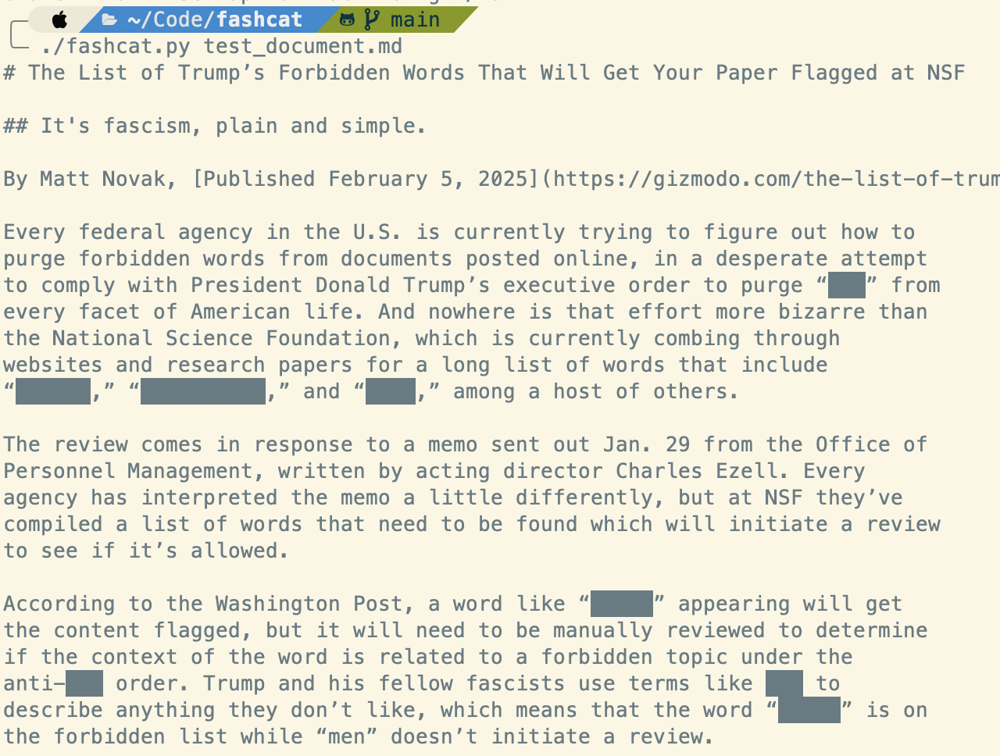

# fashcat

## 😺 Fascism Cat

It's the `cat` command, except it redacts the NSF list of prohibited words.

## 🚫 Inspiration

This tool is inspired by the word list published at
<https://gizmodo.com/the-list-of-trumps-forbidden-words-that-will-get-your-paper-flagged-at-nsf-2000559661>

## 🙌 Public Domain

fashcat by Brian Enigma is marked with CC0 1.0 Universal. To view a copy of this license, 
visit <https://creativecommons.org/publicdomain/zero/1.0/>

## ⏮️ Prerequisites

- Python 3. No more. No fancy libraries or anything.

## ⌨️ Usage

Use `fashcat.py` in place of cat. For example, a snippet of the output of
`./fashcat.py test_document.md` looks like this:

> Every federal agency in the U.S. is currently trying to figure out how to
> purge forbidden words from documents posted online, in a desperate attempt
> to comply with President Donald Trump’s executive order to purge “███” from
> every facet of American life. And nowhere is that effort more bizarre than
> the National Science Foundation, which is currently combing through
> websites and research papers for a long list of words that include
> “██████,” “██████████,” and “████,” among a host of others.

## 🔃 Updating

- The word list is in `wordlist.txt`
- The script `process_wordlist.py` will take that wordlist and turn it into 
  the `word_list: list[str]` array expected in the main app.
- Take that and replace the `word_list` in `fashcat.py`.

# ‼️ Known Issues

Okay, this is a toy program. It's here to make a point. Some known issues that
haven't been addressed include:

- It works line-by-line. If your phrase is split across lines, it won't match.
- The redaction uses UTF-8 characters. Your terminal must support UTF-8.
